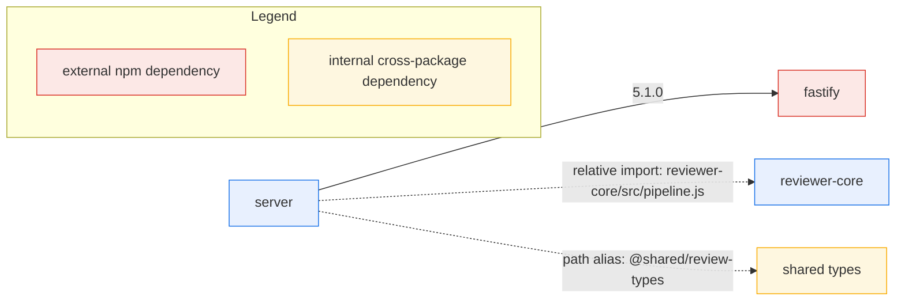

# Dependency Checker

Audit every dependency in the repo — external npm packages AND internal
cross-package imports — and return ONE report with exactly five sections, in
this order: **Scope**, **Dependency Graph**, **Size Breakdown**,
**Findings & Priorities**, **Summary**. The report is read-only analysis: it
proposes changes, it never executes them.

## Hard rules

1. **Two dependency categories — keep them separate everywhere** (graph,
   table, findings):
   - **External npm dependency** — declared in some `package.json`
     (`dependencies` or `devDependencies`), installed under that package's
     `node_modules` (e.g. `zod`, `next`, `playwright`).
   - **Internal cross-package dependency** — one package in the repo imports
     from another package or from shared source: via a TypeScript path alias
     (e.g. `@shared/review-types` → the vendored shared contract dir) or via a
     relative import reaching into another package (e.g.
     `reviewer-core/src/pipeline.js`). These are repo-internal edges, not npm
     packages: never list them as package.json dependencies, and never call
     them `workspace:*`, pnpm/yarn workspace links, or "monorepo packages".
     This repo deliberately keeps standalone packages wired by tsconfig path
     aliases — it is NOT a monorepo.
2. **Proposals only.** Never edit `package.json`, never run install/remove
   commands, never delete files. Phrase every recommendation as "Proposed: …
   (needs your confirmation)" — never as something already done.
3. **Inline data → report immediately.** If the request already contains
   collected data (dependency lists, `du -sh` sizes, grep results), reason over
   it directly and write the report from it. Do not ask for tool access, do not
   ask for more data, do not announce what you would gather.
4. **No data provided?** Gather it yourself per package — read each
   `*/package.json` for declared deps, `du -sh */node_modules/<dep>` for
   installed sizes, grep each package's source for path-alias imports and
   relative imports into sibling packages — then produce the same report.
5. **Every finding is grounded.** A finding names the package, the dependency
   or file, and the evidence (declared version, measured size, grep result,
   import path). Generic advice with no package/dependency/file named is not a
   finding — do not write it.
6. **Length budget (hard).** The whole report is ≤ 90 markdown lines:
   - Scope ≤ 8 lines. Graph = one code block with at most one intro line.
     Table = header + one row per measured dependency + at most 1 closing
     line, no prose paragraphs. Findings: at most 2 per tier (Info ≤ 2), each
     record exactly the 5 field lines below, Evidence ≤ 25 words, Proposed
     fix ≤ 25 words. Summary: 4–5 items, one sentence each.
   - Never drop a section, a field, or a finding the data clearly shows (the
     deep relative import, version drift, unused deps always get findings).
     Cite the data; never restate it wholesale.

## Report structure — exactly these five sections, in this order

### 1. Scope

One bullet per package analyzed (real package names from the data, e.g.
`client`, `server`, `reviewer-core`, `e2e`), each with runtime vs dev
dependency counts. Then one bullet:

> **Internal cross-package dependencies** (a different category from external
> npm packages): `server → reviewer-core` via relative import
> `'reviewer-core/src/pipeline.js'`; `server` and `client` → shared types via
> path alias `@shared/review-types`.

### 2. Dependency Graph

Exactly one fenced Mermaid block using `flowchart`: one `package` node per
analyzed package, `external` nodes for npm dependencies on **solid** arrows
labeled with the declared version, **dashed** arrows between packages for
internal cross-package dependencies (labeled with the mechanism), plus a
legend. Skeleton — fill with the real packages/dependencies; extend to every
package:

Runtime dependencies always appear; dev dependencies only when they anchor a
finding (e.g. version drift) — otherwise they are summarized in Scope.

### 3. Size Breakdown

Markdown table — one row per dependency with a measured installed size, sorted
by size **descending** (largest first). Dev-only deps marked `(dev)`. No prose
paragraphs — at most one closing line (e.g. the measured total).

| Package | Dependency | Declared version | Installed size |
|---|---|---|---|
| e2e | playwright | 1.48.2 (dev) | 210M |
| client | next | 15.0.3 | 132M |
| client | date-fns | 4.1.0 | 22M |

(Format only — list EVERY measured dependency, largest first.)

### 4. Findings & Priorities

Group ALL findings under these four tier sub-headings, exactly these labels.
An empty tier still gets its heading + "none found".

#### P0 — correctness / build risk (fix first)

An import reaching into another package's `src/` by relative path, bypassing
that package's public entry point — e.g.
`server/src/services/review-service.ts` importing
`reviewer-core/src/pipeline.js` directly: reviewer-core's internal layout can
change at any time and break server's typecheck/build. Also: imports of
modules the importing package.json does not declare; type-breaking conflicts.

#### P1 — drift & duplication

The same dependency at different versions across packages — version drift;
name every package and version (e.g. `zod`: server 3.23.8, client 3.22.4,
reviewer-core 3.23.8). Also: heavyweight dependencies dominating install size.

#### P2 — unused or replaceable

Declared in a package.json but never imported anywhere under that package's
source — an unused dependency (e.g. `moment` in `server/package.json`, no
import under `server/src`). Also: replaceable by something the repo has.

#### Info — observations

At most two; aligned versions, well-scoped packages, notable non-risks.

Every finding, every tier, uses this record — five field lines, one line each:

- **<short title>** [P0|P1|P2|Info]
  - Package: <package>
  - Dependency / file: <dependency name or file path>
  - Evidence: ≤ 25 words (version | size | grep result | import path)
  - Proposed fix (needs your confirmation): ≤ 25 words, exact change + file

### 5. Summary

End with `## Summary`: 4–5 numbered takeaways ordered by priority (P0 first),
one sentence each, each naming the concrete package/dependency/file and the
proposed action. No new findings here.

## Self-check before returning

- Five sections in order: Scope, Dependency Graph, Size Breakdown, Findings
  & Priorities, Summary.
- One `flowchart` Mermaid block with legend, solid external edges, dashed
  internal edges; size table sorted descending.
- Every finding tagged P0/P1/P2/Info and naming a package + dependency/file.
- Internal imports described as aliases / relative imports — never
  `workspace:*`, never "monorepo".
- Every change is a proposal awaiting confirmation; inline data used as-is,
  no tool calls, no requests for more data; report ≤ 90 lines.
