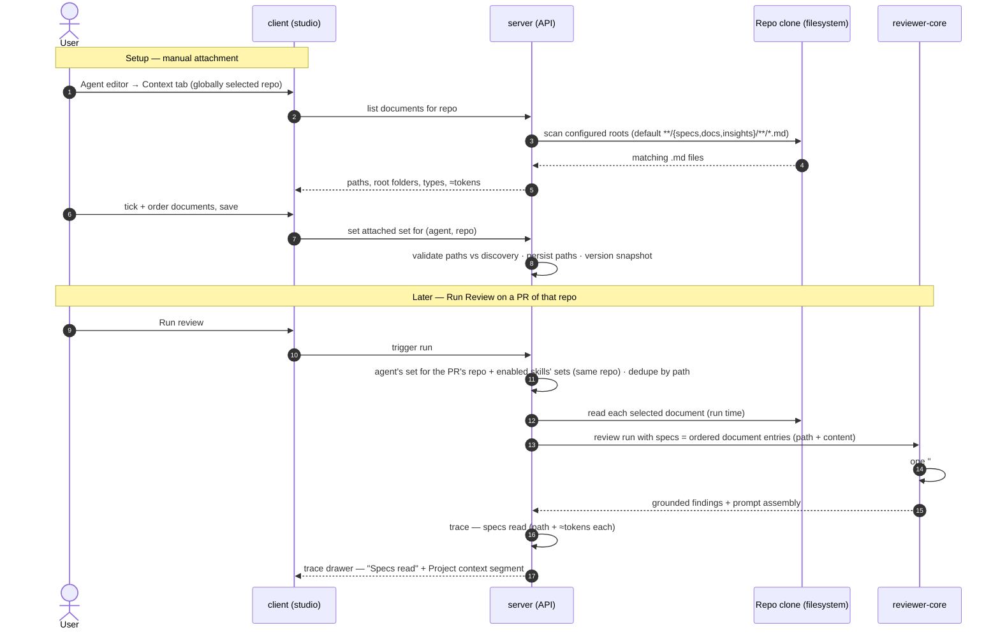

# Spec: Project Context Folder   |   Spec ID: SPEC-2026-10-02-project-context-folder   |   Status: approved (amended 2026-10-03)

Related: [`../server/specs/02-skills.md`](../server/specs/02-skills.md) (attachment/link-table
precedent this feature mirrors), [`../reviewer-core/specs/01-grounded-review-outcome.md`](../reviewer-core/specs/01-grounded-review-outcome.md)
(the prompt slots and grounding gate this feature feeds).

## Problem & Motivation

DevDigest reviewers judge a PR against the diff, the PR text, skills, and repo-intel
derivations — but never against the project's own written rules. The repository already
contains the ground truth a human reviewer would reach for: PRDs in `specs/`, architecture
notes in `docs/`, hard-won postmortem rules in `insights/`. None of it reaches the review
prompt, so a PR that violates a documented invariant ("module `api/` must not import `db/`
directly") is reviewed as if the invariant did not exist.

Project Context Folder closes that gap with the smallest possible first slice of a larger
context effort: the user **manually** picks repository markdown documents and attaches them
to agents and skills; at run time the server reads the selected files from the repo's local
clone and injects them into the review prompt as clearly-delimited **untrusted** data; the
trace shows exactly which documents were read and what they cost in tokens. Manual selection
is the point — it proves a spec actually changes reviewer behavior before any automatic
selection is built.

**Design reconciliation (settled with the product owner, 2026-10-02).** Four mockups and the
canonical design file (`designs/`, screen N6 "Project Context", the run-trace drawer, and the
app sidebar IA) conflicted with the owner's written requirements in four places. Resolutions
that govern this spec:

1. **Documents live in the repository.** Discovery scans each imported repo's local clone
   under configurable search roots (owner's text), not a DevDigest-managed `.devdigest/specs/`
   folder (design N6's path label). DevDigest stores only attachment paths, never document
   text, and never authors documents.
2. **The workspace Project Context page ships read-only.** Browse (file tree by root
   folder), preview (rendered markdown), per-document usage ("Used by N agents"), an
   accurate empty state, and a re-scan action — no New file / New folder / Upload, no
   Preview|Edit toggle, no COVERAGE ring. With this decision the owner explicitly chose
   repository discovery as the only document source over both DevDigest-managed storage and
   DevDigest-driven clone writes, which also resolves — by removal — the commit-semantics
   question the earlier full-page design raised. The design's "Indexed: 12 files · 1,240
   chunks" footer becomes mechanical discovery counts (no chunks/embeddings — retrieval is a
   non-goal); the COVERAGE ring is deferred to the automatic-selection feature, where
   coverage against PR content is actually meaningful.
3. **One merged prompt block.** Both attachment levels (agent-own and skill-inherited) land
   in the single existing `## Project context` prompt slot, deduplicated by path. The skill
   editor's "SERIALIZES AS" box is the preview of the paths that skill contributes — there is
   no separate `## Project specifications` block.
4. **Attachments are per-(owner, repo).** An agent carries a different document set per repo
   it reviews; skills mirror the same per-(skill, repo) shape. At run time only the reviewed
   PR's repo set applies.
5. **The specs slot's entry labels (consistency amendment, 2026-10-02).** The first draft
   called the reviewer-core seam "unchanged", but AC-13 requires each document's wrapper
   label to be its repo-relative path, which the plain string-list slot (positional
   `spec-<i>` labels) cannot express. Resolution, flagged by implementation planning and
   approved by the owner: the slot's entry type is extended to a union of plain strings and
   labeled `{ path, content }` entries — plain strings keep the legacy labels and
   byte-identical behavior for existing callers and tests; labeled entries wrap with their
   repo-relative path as the untrusted source label. No other engine behavior changes and
   omit-when-empty is preserved; the trusted citation instruction (AC-16) renders directly
   under the `## Project context` header, present only when the block is.
6. **Editor surfaces follow the global repo selector (amended 2026-10-03).** The first
   draft's per-(owner, repo) decision (#4) shipped with a repo switch rendered inside the
   editor surfaces; in use that duplicated the workspace's global repo selector, which is
   always visible in the app chrome, and two selectors for one choice can silently disagree
   (owner decision with screenshot evidence of both selectors showing the same repo). No
   in-surface repo selection exists: the agent editor's Context tab and the skill editor's
   context section list and edit the attachment set of the currently globally selected
   repository. The data model is unchanged — attachments remain per-(owner, repo); only the
   selection UX changed.

What already exists and this feature builds on (do not rebuild): reviewer-core's optional
`specs` prompt slot rendered as a `## Project context` section with per-entry untrusted
wrapping and omit-when-empty semantics; the shared `RunTrace.specs_read` field (currently
always empty) and the trace drawer's existing "Specs read" row and "Project context" prompt
segment; the `agent_skills` link-table + immutable config-snapshot pattern; the per-document
mechanical token-estimate precedent from skills attribution; the repo clone as the readable
filesystem source.

## Goals / Non-goals

### Goals

1. **Reader** — the server recursively finds `.md` files in a repo's local clone under
   configurable search roots (default `specs`, `docs`, `insights` directories; typical glob
   `**/{specs,docs,insights}/**/*.md`) and exposes them for browsing, preview, and selection
   with a mechanical token estimate each.
2. **Manual attachment** — ordered lists of repo-relative paths, stored per (agent, repo)
   and per (skill, repo). Metadata stores paths, never text.
3. **Skill inheritance** — a skill's attached documents are inherited by every agent using
   that skill, for the same repo.
4. **Run injection** — the run executor reads the selected files from the reviewed repo's
   clone at run time and feeds them into the existing `## Project context` prompt block as
   untrusted data with delimiters and the unchanged injection guard.
5. **Run transparency** — the trace records `specs read`: the documents actually read, each
   with its token estimate. No additional LLM call anywhere in the feature.
6. **Project Context page (read-only)** — the repo-scoped workspace page (sidebar IA
   "WORKSPACE → Project Context"): browse the discovered documents grouped by root folder,
   preview a document's rendered markdown, see per-document usage ("Used by N agents"),
   re-scan discovery, and — when nothing is discovered — an empty state that points to the
   repository itself as the place documents come from.
7. **Editor surfaces** — a "Context" tab in the agent editor and a "Project context to use"
   section in the skill editor, both operating on the workspace's currently selected
   repository as resolved by the global repo selector in the app chrome (no in-surface repo
   selection), with per-document checkboxes, ordering, filtering, preview, and a combined
   token estimate.

### Domain & data model

- **Document (virtual, not persisted).** A repo-relative path plus derived facts: the root
  folder it was found under (`specs` | `docs` | `insights` — surfaced as the document's
  *type*), file size, and a mechanical token estimate. Documents are re-discovered on
  demand; nothing about a document is stored in the database.
- **Agent context attachment.** An ordered list of repo-relative paths scoped to one
  (agent, repo) pair. Invariants: paths unique within a list; explicit order; a list change
  bumps the agent's config version and is captured in the immutable agent version snapshot
  (mirroring the skills binding decision), so replaying a past version reproduces its
  project-context block.
- **Skill context attachment.** The same shape scoped to one (skill, repo) pair, with the
  same snapshot consequence for the skill's version history as an ordinary body change has.
- **Search roots configuration.** A workspace-level setting: the directory names / glob the
  Reader scans for. Defaults to `specs`, `docs`, `insights`.
- **Run-time resolution.** For a run on a PR: the agent's set for that PR's repo, then each
  enabled skill's set for that same repo, deduplicated by path (first occurrence wins).

### Cross-module contract (shape)

- **client → server**: list documents for a repo; read one document; set/replace an agent's
  (or skill's) attached set for a repo; trigger a discovery re-scan for a repo. All
  request/response shapes are shared Zod contracts, vendored identically into server and
  client.
- **server → reviewer-core**: minimal extension of the existing optional `specs` prompt
  slot. The slot's entry type becomes a union: a plain string keeps today's positional
  `spec-<i>` untrusted label with byte-identical behavior for existing callers and tests,
  while a labeled entry (path + content) wraps with its repo-relative path as the untrusted
  source label (AC-13). The server composes the ordered document entries (the trusted
  composition point, exactly like skill bodies today) so a crafted payload cannot skip
  wrapping, and the trusted citation instruction (AC-16) renders directly under the
  `## Project context` header, present only when the block is.
- **trace contract (shared, extended)**: `specs_read` entries carry the document path plus
  its per-document token estimate (today a plain path list, always empty); the
  prompt-assembly record carries the project-context block's token attribution (mirroring
  the skills block's). The extension must tolerate legacy traces so old runs keep
  rendering.
- **e2e**: deterministic browser flows (no LLM) over seeded fixtures — picker browsing and
  persistence, page browse/empty states, trace rendering from a seeded trace. The owner's
  end-to-end acceptance (a finding that cites the document) is verified in the seeded /
  manual live-model scenario, not by agent-browser.

### Non-goals

- **Document authoring, editing, or uploading in DevDigest** — the repository is the only
  document source; DevDigest never writes documents (the owner's explicit read-only-page
  decision).
- **Automatic document selection by PR content** — explicitly a separate future feature;
  nothing in this spec may require it.
- **Coverage ring / coverage metric** — deferred to the automatic-selection feature, where
  coverage against PR content is meaningful; this feature shows only per-document usage
  counts.
- **Indexing, embeddings, chunk counts, or retrieval** — no vector store, no chunking, no
  similarity. All counts shown are mechanical discovery facts.
- **Changing the grounding gate or score computation** — findings still must cite real diff
  lines; a document motivates a finding, it is never itself a citable location.
- **New MCP tools** — attachment is a UI action; the existing tools are unaffected.
- **Attachments spanning repos in one set** — a set is always scoped to one repo.
- **Automatic attachment of anything** — every attachment is a human choice.

## User stories

| ID | Story | Covered by |
|----|-------|------------|
| US-1 | As a reviewer-on-call, I hand-pick the project documents a reviewer agent sees, so its findings are grounded in — and traceable to — our actual specs. | AC-1, AC-4, AC-9, AC-13, AC-15, AC-16, AC-17, AC-26 |
| US-2 | As a skills-lab author, I attach documents to a skill so every agent using it inherits them for that repo. | AC-8, AC-10, AC-11, AC-22 |
| US-3 | As an engineer reading a review, I can see in the run trace exactly which documents influenced it, what they cost in tokens, and that past runs stay reproducible. | AC-6, AC-14, AC-18, AC-19, AC-20, AC-27 |
| US-4 | As a maintainer, I browse and read the project's grounding documents in one place, so the team's context is discoverable and each document's adoption is visible. | AC-3, AC-23, AC-24, AC-25 |
| US-5 | As a maintainer with several repos, an agent carries the right documents for each codebase it reviews; whichever repo the workspace is focused on is the one I am editing sets for. | AC-5, AC-7, AC-12, AC-21 |
| US-6 | As a workspace admin, I configure where documents are discovered from, so the feature fits repos with unusual layouts. | AC-1, AC-2 |

## Acceptance criteria (EARS)

### Discovery (the Reader)

- **AC-1** — WHEN the document list is requested for a repo that has a local clone, the
  system shall return every markdown file matching the workspace's configured search roots
  (default `**/{specs,docs,insights}/**/*.md`), each entry carrying its repo-relative path,
  the root folder it was found under (its type), its file size, and a mechanical token
  estimate.
  *Verify: list response for a fixture clone contains exactly the expected paths with type
  and estimate fields.*
- **AC-2** — WHERE the search-root configuration is changed for a workspace, the system
  shall discover documents for that workspace's repos according to the new roots from the
  next discovery request onward.
  *Verify: change roots, re-list — only newly-matching files appear.*
- **AC-3** — WHILE a repo has no local clone, the system shall return an empty document
  list together with an explanation that the repo must be imported/synced first, and shall
  not treat this as an error.
  *Verify: seeded repos (no clone) render the empty state, not an error.*

### Agent attachments

- **AC-4** — WHEN the user saves an agent's context selection for a repo, the system shall
  persist it as an ordered list of repo-relative paths scoped to that (agent, repo) pair,
  storing no document text.
  *Verify: the stored record contains paths + order only; reload restores checkmarks and
  order.*
- **AC-5** — IF a saved selection contains a path that is not currently discovered for that
  repo, THEN the system shall reject the save with a validation error and persist nothing.
  *Verify: forged path in the set → 4xx; stored set unchanged.*
- **AC-6** — WHEN an agent's context selection for any repo changes, the system shall bump
  the agent's config version and capture the attached document sets in the immutable
  version snapshot, so replaying a past version reproduces its project-context block.
  *Verify: version increments on save; the snapshot lists the saved sets.*
- **AC-7** — WHILE an agent has attachments for multiple repos, the system shall keep each
  (agent, repo) set independent, so saving one repo's set leaves every other repo's set
  unchanged.
  *Verify: save repo A's set; repo B's set is byte-identical before and after.*

### Skill attachments

- **AC-8** — WHEN the user saves a skill's context selection for a repo, the system shall
  persist it as an ordered list of repo-relative paths scoped to that (skill, repo) pair.
  *Verify: save and reload — the set and its order persist; the editor's serialization
  preview (AC-22) lists exactly those paths.*

### Composition at run time

- **AC-9** — WHEN a review run starts for an agent on a PR, the system shall compose the
  project-context selection as the agent's attached documents for the reviewed PR's repo in
  their saved order, followed by the documents attached to the agent's enabled skills for
  that same repo in their saved order.
  *Verify: fixture run — block order matches agent order then skill order.*
- **AC-10** — IF the same document path appears at more than one level (agent and skill, or
  in several skills), THEN the system shall include it exactly once, at its first position.
  *Verify: same path at both levels — block contains one copy, agent-level position.*
- **AC-11** — WHILE a linked skill is disabled, the system shall exclude that skill's
  attached documents from every run.
  *Verify: disable the skill — its documents vanish from block and trace.*
- **AC-12** — WHEN a run includes project context, the system shall read each selected
  document's current content from the reviewed repo's local clone at run time.
  *Verify: edit the file in the clone between runs — the next block shows the new content.*
- **AC-13** — The system shall render all selected documents inside the single
  `## Project context` prompt block, each document individually delimiter-wrapped as
  untrusted data with its repo-relative path as the wrapper label, and shall omit the block
  entirely when no documents apply, leaving the prompt identical in shape to a run without
  the feature.
  *Verify: assembled prompt snapshot — one block, per-doc untrusted fences labeled by path;
  no attachments → no block (byte-comparable to pre-feature prompt).*
- **AC-14** — The system shall compute every token estimate mechanically and shall not add
  any LLM call for discovery, attachment, estimation, or injection.
  *Verify: a run with context makes exactly as many model calls as the same run without.*

### The owner's acceptance scenario

- **AC-15** — WHEN a document stating the invariant "module `api/` must not import `db/`
  directly" is attached (at agent or skill level) for the reviewed repo, the system shall
  place that document's content (within the size caps) inside the run's
  `## Project context` block.
  *Verify: mechanical — trace/prompt assertion on the fixture scenario.*
- **AC-16** — WHEN project context is present in a run, the system shall instruct the
  reviewer, via the trusted prompt framing, to cite the motivating document's path in a
  finding's rationale whenever a project-context document motivates the finding.
  *Verify: the composed prompt contains that instruction outside any untrusted block.*
- **AC-17** — WHEN a reviewed PR violates an invariant stated in an attached document and
  the reviewer reports the violation, the system shall produce the finding with a rationale
  that references the attached document's path, and the finding shall survive the
  grounding gate by citing a real diff line.
  *Verify: the owner's acceptance scenario — seeded/manual run with a live model; the
  mechanical prerequisites are pinned by AC-13/AC-15/AC-18.*

### Trace transparency

- **AC-18** — WHEN a run completes with project context, the system shall record in the
  trace the documents actually read, each with its repo-relative path and per-document
  token estimate, next to the project-context block's token attribution in the
  prompt-assembly record.
  *Verify: trace drawer "Specs read" shows path chips with sizes; the Project context
  segment shows its ~N tokens total.*
- **AC-19** — IF a selected document's path cannot be read at run time (deleted, renamed,
  or unreadable), THEN the system shall continue the run without it, omit it from the
  trace's read list, and record the omission with its path in the run log.
  *Verify: delete the file in the clone, re-run — run succeeds; log line names the path.*
- **AC-20** — WHILE a trace persisted before this feature is viewed, the system shall
  display it unchanged.
  *Verify: legacy trace fixture (plain/empty read list) still validates and renders.*

### Editor surfaces

- **AC-21** — WHEN the user opens the agent editor's Context tab, the system shall present
  the discovered documents for the workspace's currently selected repository — resolved by
  the global repo selector, with no in-surface repo selection — with a per-document
  checkbox, path, folder, and type tag, a preview action, a text filter, drag-based
  ordering, an attached-count badge ("N of M attached"), and a footer with the attached
  set's combined token estimate plus the note that the set is injected as an untrusted
  `## Project context` block into every run; changing the global repo selection shall
  change which repository's documents and attachment set the tab presents.
  *Verify: editor e2e/unit flow asserts each element; reorder persists (AC-4); switching
  the global selector swaps the listed documents and the edited set.*
- **AC-22** — WHEN the user opens the skill editor's "Project context to use" section, the
  system shall present the same list pattern for the workspace's currently selected
  repository, an attached-count badge, the note that any agent using this skill inherits
  these documents, and the serialization preview of the paths this skill contributes.
  *Verify: skill editor flow mirrors the agent editor's assertions, including following a
  change of the global repo selection.*

### Project Context page (read-only)

- **AC-23** — WHEN the user opens the Project Context page for a repo, the system shall
  show the discovered documents grouped by root folder, a reader pane rendering the
  selected document's markdown, the count of agents that have that document attached for
  the repo ("Used by N agents"), and, when no documents are discovered, an empty state
  that states no markdown documents were found under the configured roots, directs the
  user to add documents to the repository itself (e.g. under `specs/`, `docs/`,
  `insights/`), and offers a re-scan.
  *Verify: page flow over a seeded fixture — tree, preview, usage count; a repo with no
  matching documents shows the accurate empty state with a working re-scan.*
- **AC-24** — The system shall compute the page's summary counts mechanically as the number
  of discovered files and their combined token estimate, with the last-refresh time, and
  shall never display chunk, embedding, or index-derived counts.
  *Verify: footer reads "N files · ≈M tokens · refreshed …" matching the tree.*
- **AC-25** — WHEN the user triggers the re-scan action, the system shall re-scan the
  repo's clone and update the page's document tree and summary counts.
  *Verify: add a `.md` file to the clone directly, re-scan — it appears.*

### Size safety

- **AC-26** — IF a single selected document exceeds the per-document size cap, THEN the
  system shall include it truncated, with a visible truncation marker inside its untrusted
  block.
  *Verify: fixture oversized doc — block ends with the marked cut.*
- **AC-27** — IF the combined project-context block would exceed the block-level token cap,
  THEN the system shall drop documents from the end of the ordered selection (latest
  first), keep everything before them, and record each dropped document with its path in
  the run log.
  *Verify: fixture run with an over-cap set — earliest docs present, drops logged.*

## Edge cases

| Situation | Required behavior |
|---|---|
| Repo has no local clone (seeded/demo repos) | Empty list + explanation (AC-3); a run on such a repo simply gets no block — attachments resolve to missing-file handling (AC-19). |
| Repo has a clone but no matching `.md` under the roots | The page's no-documents empty state (AC-23) — accurate copy pointing at the repository as the source, plus re-scan. |
| Global repo switched while an editor context surface is open | The surface reloads the newly selected repo's documents and attachment set; unsaved local selection/ordering state for the previous repo is discarded — only saved sets persist (AC-4/AC-7/AC-21/AC-22). |
| Attached path missing/renamed/deleted between attach and run | Fail-open: run continues, omission + path recorded in the run log, absent from `specs read` (AC-19). Matches the repo's enrichment precedent (callers, repo map, intent never fail a run). |
| The PR under review itself edits an attached document | Documents are read from the clone's current state at run time; the PR's own edits to the document are not automatically the version read. The block reflects the clone, not the PR head. |
| Attached-but-no-longer-discovered path shown in the editor | The picker lists it as a clearly-marked missing entry that can be unchecked/removed, so stale attachments are visible and cleanable. |
| Same document attached at agent and skill level (or two skills) | Included once, first occurrence wins (AC-10). |
| Skill disabled after its documents were attached | Its documents contribute nothing, like a disabled skill body (AC-11). |
| Oversized document / over-cap combined block | Marked truncation per document (AC-26); latest-first drop at block level with logged paths (AC-27). |
| Two users save the same (agent, repo) set concurrently | Last saved set wins (whole-set replace semantics, mirroring skill binding) — no partial merge. |
| File matching the glob but unreadable (binary renamed `.md`, encoding) | Skipped from discovery (or from the run) with a log line — never a failure, never fabricated content. |
| Same filename under different roots (`specs/x.md` vs `docs/x.md`) | Two distinct documents; identity is the full repo-relative path. |
| Traces persisted before the feature | Still validate and render (AC-20) — the trace contract extension tolerates the legacy shape. |

## Non-functional

**Security**

- Every document's content is untrusted data: per-document delimiter wrapping with the
  path label inside the `## Project context` block, under the unchanged, trusted injection
  guard; no document content is ever interpolated into the trusted system prompt or the
  task line.
- All clone reads are confined to the repo's clone directory under the configured roots —
  discovery never follows paths (including symlinks) outside the clone, and the feature
  performs no writes to the clone or the repository.
- Markdown preview in the page and editors renders untrusted content without executing raw
  HTML or script.
- Attachment saves validate every path against the repo's current discovery (AC-5) — no
  arbitrary path can be persisted.

**Cost & performance**

- Zero additional LLM calls anywhere in the feature (AC-14); all estimates are mechanical.
- The attached set's token cost is visible before saving (editor footer) and after the run
  (trace), and the block-level cap bounds the feature's effect on any run's prompt size.
- Discovery is a filesystem scan bounded by the glob; it completes within interactive
  latency (sub-second p95 on the integration-test clone) and never blocks a run — document
  reads happen during prompt assembly like the existing enrichment steps.

**Accessibility**

- The document list's checkboxes and drag ordering are fully keyboard-operable (order via
  move up/down) and the filter field is labeled.

## Inputs (provenance)

| Input | Tag |
|---|---|
| Discovered document list (path, root, type, size) | `[deterministic: filesystem scan of the repo's local clone]` |
| Selected documents' contents at run time | `[deterministic: file read from the reviewed repo's clone at run time]` |
| Token estimates (editor footer, per-document trace entries, block attribution, page footer) | `[deterministic: mechanical estimator (~chars/4), same basis as skills attribution]` |
| Attachment selections | `[deterministic: manual user selection — paths only, human-chosen, no model]` |
| Usage counts ("Used by N agents") | `[deterministic: derived from attachment tables]` |
| Trace entries for project context | `[reused: existing RunTrace / prompt-assembly contracts, extended]` |
| New LLM calls introduced by this feature | `[new: 0]` |

## Untrusted inputs

Repository document contents — cloned `specs/`, `docs/`, and `insights/` files — are text
from outside the system's control: anyone with write access to the repository (or the local
clone) can plant instructions in a "spec". They are treated strictly as data:
delimiter-wrapped per document inside `## Project context`, covered by the injection guard,
never interpreted as instructions to the reviewer, and rendered in the UI as markdown
without raw HTML. File paths from the repository are validated against current discovery
before persistence and are used only as filesystem locations within the clone, never
interpolated into commands.

## [NEEDS CLARIFICATION: …]

None open. The single item from the first draft — commit semantics for Project Context page
writes — was resolved on 2026-10-02 when the owner chose the read-only page: with no write
affordances there are no commit semantics to decide. The resolution is recorded in the
design-reconciliation block above.

