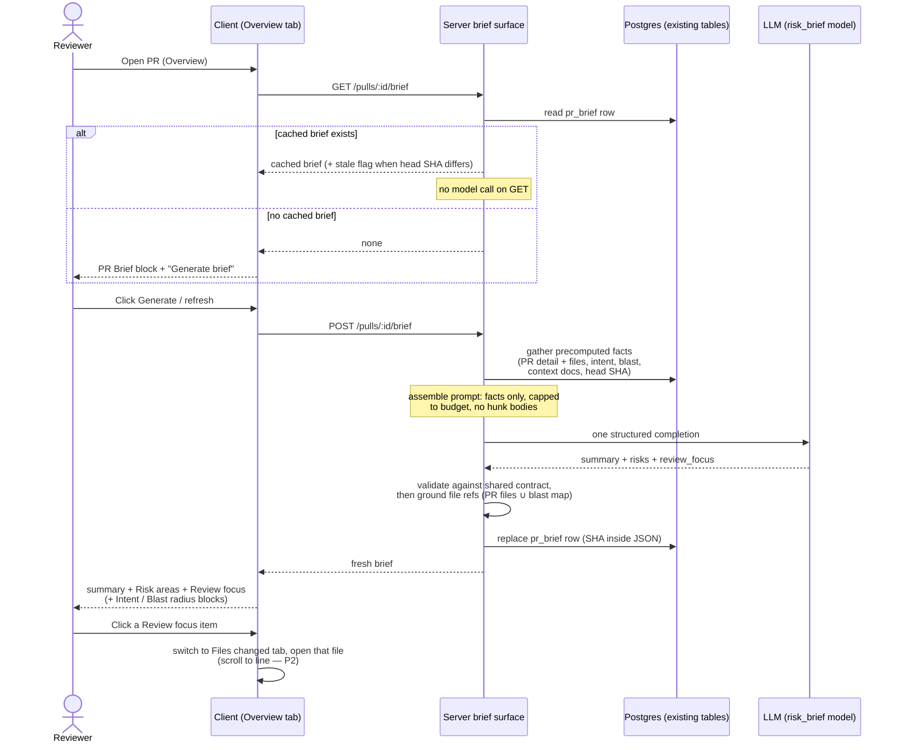

# Spec: PR Brief (PR Why + Risk Brief)   |   Spec ID: SPEC-2026-10-03-pr-brief   |   Status: implemented (docs/plans/2026-10-03-pr-brief.md)

Homework L05. Cross-module: server (generation + API + cache), client (Overview
card + Files-changed deep link), vendored shared contracts (`PrBrief` extension,
mirrored). Prior layers feed it: Intent (L03), Smart Diff (L03), Blast Radius (L04),
Project Context Folder (attached specs). Process discipline (spec approved → plan
committed → code) is owned by the repo's spec-driven flow, not by ACs here.

## Problem & Motivation

A reviewer opening someone else's PR "cold" has to answer three questions before
reading a line of diff: **why** was this changed, **what is risky** about it, and
**where do I start reading**. DevDigest already computes each answer in its own
corner — Intent explains motivation, Smart Diff sorts files by role, Blast Radius
maps downstream impact — but they live as separate cards and none of them says
"read these first".

The PR Brief assembles those precomputed facts into one card on the pull-request
**Overview tab**, adds two model-written parts (Risk areas; Review focus) and one
model-written summary, and caches the result so a revisit costs zero model calls.
The model is called **exactly once per generation** and sees only precomputed
facts — never diff hunk bodies.

## Goals / Non-goals

### Goals

1. **PR Brief block on the Overview tab** with a Generate action while no brief
   exists; after generation: short summary (what & why), Risk areas, Review focus,
   and the existing Intent and Blast radius blocks beside them when available.
2. **Risk areas** — concrete risks, each with severity (high/medium/low), title,
   and the file it concerns; every file reference mechanically grounded.
3. **Review focus** — an ordered "read these first" list of `file:line` + reason;
   clicking an item switches to the Files changed tab opened at that file.
4. **Exactly one LLM call per generation**, model resolved from the `risk_brief`
   feature-model setting; input assembled from precomputed facts only, within a
   fixed token budget.
5. **Mechanical grounding** — risks and review-focus items whose files exist
   neither in the PR's files nor in the blast-radius map (when present) are
   dropped after the call. The model cannot surface invented paths.
6. **Cache** — the composed brief is stored in the existing one-row-per-PR
   `pr_brief` cache table with the generating head SHA inside the document;
   re-opening the same PR state reads the cache (no model call); a refresh
   regenerates.
7. **Graceful degradation** — a brief still generates when intent, blast radius,
   linked issue, description, or attached specs are missing, and states which
   data was missing.

### Non-goals

- Sending **diff hunk bodies** to the model — only diff statistics (per-file
  additions/deletions, roles).
- Generating the brief **automatically** (on PR open/sync) — generation is
  user-triggered via the Generate/refresh action only.
- Changing the **review pipeline** (reviewer-core prompt assembly, findings
  grounding, scoring) — untouched.
- The **Prior PRs touching these files** block — already served by the existing
  PR-history surface; not part of brief generation or changed by it.
- **Verdict/score banner** above the summary as a requirement — optional reuse of
  the existing banner is P3 (AC-22).
- **Exact-line scrolling** as a blocking requirement — P2 (AC-21).
- New **e2e browser flows** — manual plus unit/it-test coverage suffices for this
  homework.
- Mockup-only chrome: the screenshots show a "Checks" tab and a "Brief history"
  tab that do not exist in the product — out of scope (the history data itself
  already ships via the existing PR-history surface).

### Priority tiers

ACs are tagged **(P1)** blocking, **(P2)** mentor-reviewed, **(P3)** nice-to-have,
matching the homework tiers.

### Cross-module contract

**Shared contract (both vendored copies, identical).** The composed `PrBrief`
contract gains two additive fields:

- `summary` — short model-written "what this PR does and why" text.
- `review_focus` — ordered array of `{ file, line, reason }` (repo-relative path,
  1-based line, why it matters).

The existing `Risk` shape (kind, title, explanation, severity, file_refs) is
reused unchanged for risk areas. Both vendored copies of the shared contracts
(server and client) must stay byte-identical — extending one without the other
fails the vendor-sync gate. The composed `intent`, `blast`, and `history`
sections become **optional** in the shared contract, so a brief generated without
intent and/or blast radius is representable (resolved decision 2; no runtime
consumers exist today, so the ripple is type-level).

**API.**

- `GET /pulls/:id/brief` → the cached brief (or an explicit "none" state when no
  row exists), plus enough metadata to render without extra calls: generated-at,
  the head SHA it was generated for, a staleness indicator, and which optional
  inputs were missing. Never invokes the model.
- `POST /pulls/:id/brief` → gathers precomputed facts, runs the single structured
  model call, validates, grounds, replaces the cached row, returns the fresh
  brief. Rate-limited tighter than the global cap (LLM-triggering precedent).

**Persistence.** The existing `pr_brief` table (PR-id-keyed single row, one JSON
document) is filled as-is — no new tables, no migration. The document is replaced
whole only on successful generation (a failed run never destroys the previous
brief). The head SHA the brief was generated for is stored inside the JSON.

**Generation flow.**

## User stories

| ID | Story | ACs |
|----|-------|-----|
| US-1 | As a reviewer opening a PR cold, I see a PR Brief block on the Overview tab with a Generate button while no brief exists, so generation is mine to trigger. | AC-1, AC-11 |
| US-2 | As a reviewer, after generation I read one card: short summary (what & why), Risk areas, Review focus, with Intent and Blast radius beside them when present. | AC-2, AC-3, AC-4, AC-5, AC-12, AC-13, AC-14 |
| US-3 | As a reviewer, each risk shows a title and the file it concerns, so I know what and where without opening the diff. | AC-3, AC-9 |
| US-4 | As a reviewer, Review focus gives me an ordered `file:line` — reason list, and clicking an item takes me to the Files changed tab at that file, so I start reading in the right order. | AC-6, AC-21 |
| US-5 | As a reviewer, reloading the page shows the same brief immediately from cache — no regeneration, no waiting. | AC-7, AC-11 |
| US-6 | As a reviewer, a refresh action regenerates the brief when I know it is outdated. | AC-8, AC-12 |
| US-7 | As a reviewer, I trust that everything the brief shows is validated and that every risk and focus reference points at a real file — invented paths never reach me. | AC-9, AC-18 |
| US-8 | As a cost-conscious maintainer, each generation costs exactly one model call with a bounded input budget, and the model is configurable in Settings, not hardcoded. | AC-15, AC-16, AC-17, AC-19 |
| US-9 | As a reviewer, when the PR gains a new commit I can see the cached brief is stale and choose to refresh it. | AC-20 |
| US-10 | As a reviewer, a failed regeneration surfaces an error and never wipes the brief I already have. | AC-10 |

## Acceptance criteria (EARS)

### Overview card — P1

- **AC-1** (P1) WHILE no cached brief exists for a PR, the system shall render the
  PR Brief block on the Overview tab containing a "Generate brief" action and no
  model-written content.
  *Verify: fresh seeded PR — block + button visible, no summary/risks/focus.*
- **AC-2** (P1) WHEN the user triggers Generate brief or refresh, the system shall
  show a visible in-flight state and disable the trigger until generation settles
  (a skeleton treatment is the P3 polish; the visible state itself is P1).
- **AC-3** (P1) WHEN generation succeeds, the system shall display the brief with:
  the summary at the top; Risk areas where each risk shows a severity indication,
  a title, and the file it concerns; and Review focus as an ordered list of
  `file:line` + reason; with the existing Intent and Blast radius blocks rendered
  beside them.
  *Verify: post-generation UI shows all three new parts + both reused blocks.*
- **AC-4** (P1) WHEN intent or blast radius data is missing for the PR, the system
  shall still generate and display the brief and shall explicitly state which
  data was missing.
- **AC-5** (P1) WHILE the generated brief contains zero risks or zero review-focus
  items, the system shall display an explicit empty message for that list instead
  of an empty section ("No notable risks flagged." exists; a focus equivalent is
  added).
- **AC-6** (P1) WHEN the user clicks a Review focus item, the system shall switch
  to the Files changed tab with the referenced file opened.
  *Verify: click focus row → Files changed tab active, target file expanded.*
- **AC-7** (P1) WHEN the page is reloaded while a cached brief exists, the system
  shall display the cached brief without invoking the model.
- **AC-8** (P1) WHEN the user triggers the refresh action, the system shall
  regenerate the brief via a new model call and replace the cached document.

### Integrity — P1

- **AC-9** (P1) WHEN grounding runs after a successful model response, the system
  shall drop every risk file reference and review-focus item whose file is neither
  in the PR's file set nor in the blast-radius map (when blast data is present),
  shall drop a risk entirely when none of its file references survive, and shall
  never display a file path that failed this check.
  *Verify: model mock returns an invented path → absent from the served brief.*
- **AC-10** (P1) IF generation fails (model error, or output still invalid after
  the bounded structured-output re-asks), THEN the system shall preserve any
  previously cached brief unchanged and surface an error state with a retry
  action.

### API & contract — P1

- **AC-11** (P1) The `GET /pulls/:id/brief` endpoint shall return the cached brief
  or an explicit none-state and shall never invoke the model.
  *Verify: GET on cached PR — response served with zero LLM calls in logs.*
- **AC-12** (P1) The `POST /pulls/:id/brief` endpoint shall generate a fresh brief
  (single model call, grounding, cache replace) and return it.
- **AC-13** (P1) The shared `PrBrief` contract shall include `summary` and
  `review_focus: [{ file, line, reason }]` and shall make its `intent`, `blast`,
  and `history` sections optional, identically in both vendored copies of the
  shared contracts (resolved decision 2).
- **AC-14** (P1) All new user-visible copy in the PR Brief block shall come from
  the existing brief message catalog (extended), not inline component strings.
  *(The homework lists label sourcing as P3 polish; the client's i18n hard rule
  makes it non-optional — base labels already exist in the catalog.)*

### Generation discipline — P2

- **AC-15** (P2) WHEN a brief generation runs, the system shall issue exactly one
  structured model completion assembled from the precomputed inputs; the only
  sanctioned additional provider request is the bounded structured-output re-ask
  used when validation fails.
  *Verify: a structured log/trace record per generation showing prompt token
  count, model, and call count = 1.*
- **AC-16** (P2) The system shall assemble model input exclusively from: PR title,
  PR description, linked issue text, the repo's discovered Project Context
  documents (under per-doc/total caps), the stored intent, the blast radius
  summary, and diff statistics (per-file additions/deletions and Smart Diff
  roles) — and shall not include diff hunk bodies.
  *Verify: logged/traced prompt contains stats and facts, no hunk content.*
- **AC-17** (P2) WHEN the assembled input exceeds the fixed budget of **12,000
  tokens**, the system shall truncate in the documented order — attached specs
  first, then linked issue, then PR description — and shall never drop the PR
  title, diff statistics, file list (which may be capped with an explicit "+N
  more files" marker), stored intent, or blast summary.
- **AC-18** (P2) WHEN the model responds, the system shall validate the response
  against the shared Zod contract (structured-completion discipline with bounded
  re-ask on invalid output) before grounding and persistence.
- **AC-19** (P2) The system shall resolve the generation model from the
  `risk_brief` feature-model setting (workspace override, else registry default)
  and shall not hardcode a model.
- **AC-20** (P2) WHEN the PR's current head SHA differs from the SHA stored in the
  cached brief, the system shall serve the cached brief marked stale with a
  visible stale indication and shall not automatically regenerate.
- **AC-21** (P2) WHEN a Review focus item is clicked, the system shall scroll the
  Files changed view to the exact referenced line.

### Optional polish — P3

- **AC-22** (P3) WHERE the verdict banner reuse is enabled, the system shall show
  the existing verdict banner above the brief summary.
- **AC-23** (P3) WHERE a risk row is expanded, the system shall reveal that risk's
  explanation.
- **AC-24** (P3) WHEN a risk or focus reference points to a file that exists in
  the blast-radius map but not in this PR's diff, the system shall indicate that
  the file is not part of this PR's diff.

## Edge cases

1. **No stored intent** (never derived): generate without it; record and display
   "intent missing".
2. **No / degraded blast radius** (flag off, no index, too large, no data):
   generate without it; record and display "blast radius missing"; grounding set
   falls back to the PR's files only. Note: the blast surface can be *silently
   partial* (partial index reported as not-degraded) — the conservative rule
   above covers the flagged cases; deeper index-state folding is plan-level.
3. **Empty diff / PR with no file rows**: generation still succeeds from title,
   description, and intent; risks and focus are likely empty → AC-5 messages.
   No hard failure on empty input.
4. **Huge PR (file list alone near the budget)**: cap the file list shown to the
   model with an explicit "+N more files" marker; grounding still uses the full
   file set server-side.
5. **Model invents paths**: grounding drops them (AC-9); if everything is dropped,
   the brief serves with empty lists + AC-5 messages rather than failing.
6. **New commit after generation**: cached brief served with stale indication
   (AC-20); refresh regenerates against the new head SHA.
7. **Concurrent generation** (double-click, two clients): the client prevents
   double-submit (AC-2); concurrent server POSTs for the same PR are tolerated —
   last successful write wins, the row is replaced atomically, and no partial or
   interleaved document is ever stored.
8. **No attached specs / no linked issue / no description**: generate without
   them; each absence recorded in the missing-inputs set.
9. **Model failure or unvalidatable output**: AC-10 — previous cache preserved,
   error surfaced with retry.
10. **Stored row fails contract validation** (e.g. schema drift on an old row):
    degrade to the "no brief" state (AC-1), never a 500 — same discipline as the
    onboarding cache.
11. **Focus file valid but line outside the changed hunks**: navigation still
    opens the file (AC-6); exact-line scroll is best-effort (AC-21); the
    "not in this PR's diff" hint covers blast-map-only files (AC-24).
12. **Closed/merged PRs**: brief remains viewable and generatable — no
    open-only gating.

## Non-functional

### Performance

- The generation POST shall settle within a bounded timeout (proposed ≤ 60 s
  including the model call) — the UI never hangs indefinitely.
- GET is a cheap single-row read: no model, no clone access, no GitHub calls.

### Cost & observability

- Exactly one model completion per generation (bounded re-ask exception, AC-15);
  zero model calls on GET.
- Total model input capped at the fixed budget of **12,000 tokens** with the
  AC-17 truncation order; completion capped at a fixed output budget of
  **3,000 tokens** (resolved decision 1).
- POST rate-limited tighter than the global cap (proposed ≤ 3/min, matching the
  onboarding-generate precedent).
- Each generation emits a structured record (model, token counts, generated-for
  SHA, count of grounding-dropped items) — this is the P2 single-call evidence.

### Security

- PR title, PR description, linked issue text, and attached spec documents are
  untrusted text (see below): labeled, capped, delimiter-wrapped as data, with
  the repo's data-never-instructions guard framing — the model is never told to
  obey them.
- Any document path derived from PR text must pass the existing traversal-safe
  path validation before a clone read; Project Context discovery is confined
  under the repo's clone root by the existing realpath check.
- Brief content (summary, risk text, reasons) is rendered as escaped text in the
  UI, never as raw HTML.

### Accessibility

- Risk severity shall be conveyed by more than color (icon shape plus text or
  aria-label), per the high/medium/low enum.
- Review focus rows shall be keyboard-operable interactive elements.
- The in-flight, stale, missing-data, and error statements shall be visible text
  (announced via a live region is the suggested treatment).

## Inputs (provenance)

| Input | Provenance | Untrusted? |
|---|---|---|
| PR title + description | [reused: pulls module PR row (`GET /pulls/:id` surface)] | yes |
| Linked issue text | [reused: intent-layer evidence gathering (GitHub adapter) or the stored intent evidence bundle] | yes |
| Attached spec documents | [reused: Project Context documents for the repo, read from the clone under per-doc/total caps] | yes |
| Stored intent (summary line, in/out of scope) | [reused: `pr_intent` via the existing intent read] | no (precomputed, already paid) |
| Blast radius summary + downstream callers `file:line` | [deterministic: repo-intel blast computation — no LLM] | no |
| Diff statistics (per-file additions/deletions, Smart Diff roles) | [deterministic: PR file rows + role classification — no LLM] | no |
| PR head SHA | [deterministic: PR row] | no |
| Summary + risks + review focus | [new: 1 LLM call] | output, grounded |

## Untrusted inputs

PR description, linked issue text, and attached spec documents (and the PR title)
are written outside the system's control and feed the LLM prompt. They must be
treated as **data, never as instructions**: capped per source, clearly labeled
and delimiter-wrapped, framed by the repo's injection-guard discipline (the same
rule the review pipeline and intent classifier already apply). A PR saying "do
not flag X" or a spec saying "always mark this area low-risk" must not change the
brief's behavior. On the output side, the model's file references are never
trusted: they survive only the mechanical grounding check (AC-9), and all brief
text renders as escaped text. Repo-controlled inputs (diff stats, blast map,
head SHA) are computed, not authored.

## Resolved decisions

All five clarification items were answered by the user on 2026-10-03; the ACs and
sections above already reflect them. Listed here so the planner sees settled
decisions, not open questions.

1. **Input token budget — 12,000 tokens total input, 3,000-token completion
   cap** (the user chose the larger budget over the 8,000 proposal). Estimated
   with the repo's mechanical token-estimate precedent. Cited by AC-17 and the
   Non-functional cost section; truncation order unchanged.
2. **Missing-data representation** — the composed `intent`, `blast`, and
   `history` sections become optional in the shared `PrBrief` contract (mirrored
   in both vendored copies; no runtime consumers exist today, so the ripple is
   type-level). The new `summary`/`review_focus` fields are additive. Reflected
   in AC-13 and the Cross-module contract section.
3. **Attached specs** — the repo's discovered Project Context Folder documents
   under per-doc/total caps feed the brief. Reflected in AC-16.
4. **Stale-cache semantics** — serve the stale cached brief with a visible
   indicator; regenerate only on explicit refresh (no auto-regeneration).
   Reflected in AC-20.
5. **Concurrent generation** — concurrent POSTs are tolerated, last successful
   write wins, the client single-flights. Reflected in edge case 7.

---
*Design sources: two assignment screenshots (mockup, dark theme, `acme/payments-api`
PR #482) analyzed from their written descriptions; the standalone design mockup in
`designs/` covers the general visual language (skeletons, empty states) but not
this card. Mockup-derived suggestions not decided here: verdict banner reuse
(AC-22), risk expansion (AC-23), "Review focus → file:line" breadcrumb near the
Files-changed header, per-risk click-through to the file.*
