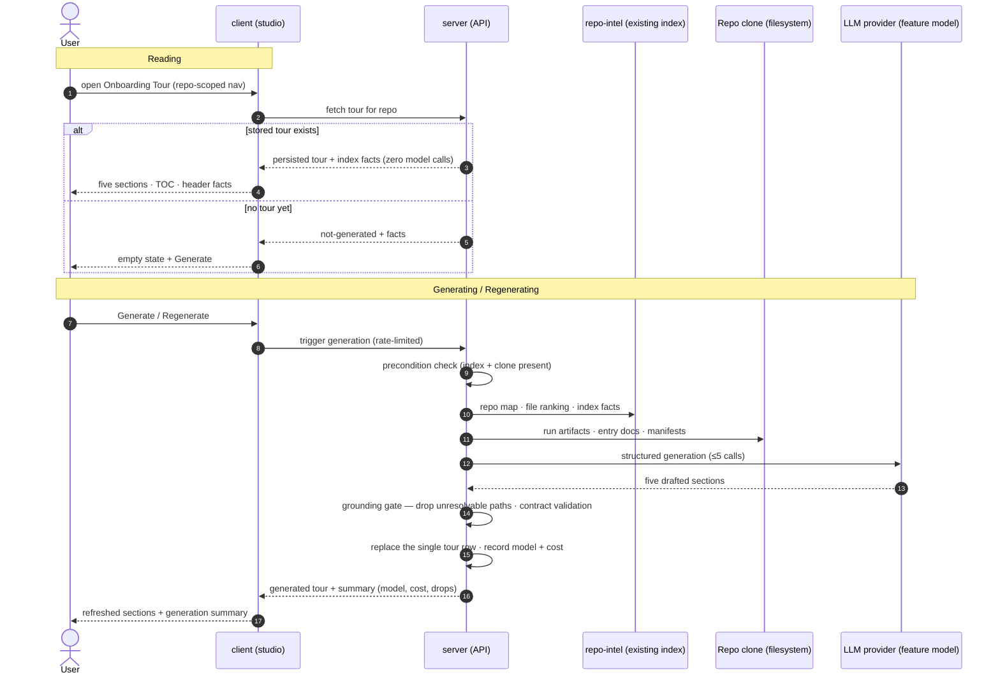

# Spec: Repository Onboarding Tour   |   Spec ID: SPEC-2026-10-03-repository-onboarding-tour   |   Status: implemented (docs/plans/2026-10-03-repository-onboarding-tour.md)

Related: [`../server/specs/03-conventions.md`](../server/specs/03-conventions.md) (the
sample → one structured model call → mechanical verification → persist → surface cost
pattern this feature mirrors), [`../server/specs/07-project-context.md`](../server/specs/07-project-context.md)
(the clone-as-source, read-only-page, honest-empty-state precedent),
[`2026-10-02-project-context-folder.md`](2026-10-02-project-context-folder.md).

## Problem & Motivation

DevDigest knows a repository better than any newcomer does: repo-intel has already
indexed its symbols, import graph, and file importance; the clone holds its README,
run configuration, and docs; the platform tracks its recent pull requests. A new
engineer joining that repository sees none of it — they get the PR list and a review
tool, and re-derive the codebase the slow way every time someone new arrives.

The repository onboarding tour turns that existing intelligence into a five-part
guided introduction, generated per repo and rendered as a studio page:

1. **Architecture overview** — a prose summary plus a rendered node-link diagram of
   the system's main components and their data flow.
2. **Critical paths** — the handful of files where the core behavior lives, each with
   a one-line description of its role and an action to open it.
3. **How to run locally** — ordered setup steps (start dependencies, install, migrate,
   run), each with the single-line command that performs it.
4. **Guided reading path** — an ordered list of files to read first, each with its
   purpose and why it matters, sequenced so each entry builds on the previous.
5. **First tasks** — concrete starter tasks for a newcomer, each anchored to a real
   artifact in the repository.

The house rule from conventions applies here too: **the model is good at composing an
explanation and bad at staying honest about what it referenced.** So generation inputs
are chosen by code from the existing index and clone, and everything the tour claims
about the repository — every file path, every command's provenance — is mechanically
verified before it is persisted. An unresolvable claim is dropped, never displayed.

What already exists and this feature builds on (do not rebuild): the repo-intel facade
(repo map, file importance ranking, callers); the index-state read surface and its
**Indexed** badge; the `onboarding` persistence slot (one row per repo: a JSON document
plus generation time — currently unused); the feature-model registry (a per-feature
model override in Settings); the seeded demo repo with its fixture clone; the
conventions module's full generation loop as the behavioral template.

## Goals / Non-goals

### Goals

1. **Generation** — an explicit user action produces all five sections for one repo
   from deterministic inputs (index facts + selected clone files + recent PR state),
   through a small bounded number of structured model calls, mechanically verified,
   persisted as one tour.
2. **Grounding** — every file path the tour cites resolves against the repo's current
   index/clone; every run-step command is traceable to a run artifact that exists in
   the clone; everything else is dropped with visible counters. Honest empty sections
   replace fabricated content.
3. **Read surface** — a repo-scoped studio page (sidebar WORKSPACE → "Onboarding
   Tour") renders the persisted tour with: header facts (index file count, generation
   age), a right-rail table of contents with scroll-spy and a read-progress indicator,
   per-section collapsible cards, per-command copy buttons, per-step completion state,
   an action to open a cited file, **Regenerate**, and **Share link**.
4. **Freshness lifecycle** — one tour per repo; regeneration replaces it whole and is
   the only way content changes; a failed regeneration never destroys the previous
   tour; the page always shows how stale the tour is.
5. **Cost transparency** — model and cost are recorded per generation and surfaced in
   the UI, and reading the page costs zero model calls.

### Domain & data model

- **Tour (persisted).** One row per repository, keyed by repo, holding a single
  contract-validated tour document plus its generation time. Invariants: at most one
  row per repo; a row is only ever replaced whole (no partial updates); a stored row
  always validates against the shared tour contract (invalid output is a generation
  failure, not a stored document); the document is an immutable snapshot — later clone
  or index changes never mutate it, they only make it stale.
- **Tour document (contract).** Five typed sections — architecture (intro prose +
  diagram-source text), critical paths (ordered `{ path, description }` entries),
  run-locally steps (ordered `{ title, description, command }`), reading path (ordered
  `{ path, purpose, why it matters }`), first tasks (`{ title, description, artifact
  reference }`) — plus generation metadata: model, cost, input-sample counters, and
  grounding-drop counters. Shared Zod contract, vendored identically into server and
  client.
- **Generation facts (derived, not persisted beyond the row).** Index-derived file
  count, index freshness, and clone presence — read from the existing surfaces at
  request time; the header's "generated from index of N files" line is a mechanical
  fact, never a model claim.
- **Client-side tour state.** Section collapse, scroll position, read progress, and
  step-completion marks are reading state, not tour content — they never touch the
  stored document. (Persistence scope: session-local client state for v1 — see
  Resolved decisions.)

### Cross-module contract (shape)

- **client → server**: fetch the tour for a repo (tour or not-yet-generated + the
  mechanical facts); trigger generation for a repo (rate-limited mutation returning
  the generated tour plus the generation summary — model, cost, sample/drop counters).
  All request/response shapes are shared Zod contracts, vendored identically into
  server and client; DTOs derive from the same schema the route declares.
- **server → repo-intel**: read-only consumption of the existing facade (repo map,
  file ranking, index state) through the container — the tour never re-indexes and
  never writes index tables.
- **server → LLM**: structured generation through the existing LLM port using the
  feature-model registry, which gains an onboarding entry (Settings → Feature Models
  override, else the registry default) — the same seam conventions uses.
- **e2e**: deterministic browser flows over seeded fixtures (a pre-generated tour row
  for the demo repo) — page rendering, TOC navigation, collapse, copy, empty state.
  Generation itself (model calls) is exercised in unit/integration lanes with the mock
  LLM, never clicked in e2e.

### Non-goals

- **Authoring or editing tour content** — the tour is generated or regenerated, never
  hand-edited; there is no editor, no draft state, no per-section regeneration.
- **Review-prompt integration** — the tour is for humans; nothing from it enters the
  reviewer prompt or affects review outcomes.
- **New MCP tools** — the tour is a studio surface; the coding-agent tools are
  unaffected.
- **Scheduled or automatic generation** — generation is an explicit user action only
  (matching the platform's no-scheduler reality); staleness is displayed, never
  auto-fixed.
- **Tour versioning/history** — one live tour per repo, replaced whole; no archive of
  previous tours.
- **In-app file browser** — the open-file action links out to the cited file at its
  hosting provider; this feature builds no file viewer.
- **Multi-repo or cross-repo tours** — a tour is always scoped to exactly one repo.
- **Indexing work** — repo-intel is consumed as-is; improving the index is a separate
  effort.

## User stories

| ID | Story | Covered by |
|----|-------|------------|
| US-1 | As a newcomer to a repo, I open one page and get a guided, ordered introduction — architecture, critical paths, what to read first — instead of reverse-engineering the codebase alone. | AC-1, AC-9, AC-10, AC-11, AC-12, AC-13, AC-16 |
| US-2 | As a newcomer, I can set up my local environment straight from the tour: ordered steps, exact commands I can copy, and a way to mark what I've done and open the files I'm told to read. | AC-14, AC-15, AC-19 |
| US-3 | As a maintainer, I regenerate the tour when the repository has moved on, without ever losing the last good one to a failed run, and I can see what a regeneration cost. | AC-2, AC-4, AC-5, AC-6, AC-17 |
| US-4 | As a maintainer, I share the tour with a new teammate by copying a link that opens exactly this page for this repo. | AC-18 |
| US-5 | As an engineer who distrusts generated content, every path, command, and task the tour shows me is mechanically verified against the actual repository — or visibly absent, with an honest empty section when nothing grounded exists. | AC-3, AC-7, AC-8, AC-20 |
| US-6 | As the workspace owner paying for model calls, generation is bounded, rate-limited, priced per run in the UI, and reading the page I already paid for costs nothing. | AC-5, AC-21, AC-22, AC-23 |

## Acceptance criteria (EARS)

### Generation & persistence (server)

- **AC-1** — WHEN generation is requested for a repo that has a usable index and a
  local clone, the system shall compose its inputs mechanically (repo map and
  top-ranked files from the index; run-configuration artifacts, entry docs, and
  manifests read from the clone; recent pull-request state), generate all five
  sections through structured model calls, and persist exactly one contract-valid
  tour for that repo stamped with its generation time.
  *Verify: seeded repo + mock structured LLM → one row; the stored document parses
  against the shared tour contract; every input the prompt consumed is reproducible
  from the fixtures.*
- **AC-2** — WHEN generation succeeds for a repo that already has a tour, the system
  shall replace the stored tour whole in a single write, so no reader can ever observe
  a mix of two generations.
  *Verify: generate twice → still one row; the row's content equals the second
  generation's output exactly; generation time advanced.*
- **AC-3** — WHEN generation is requested for a repo without a usable index or
  without a local clone, the system shall reject the request with a precondition
  error that names the missing prerequisite, before performing any model call.
  *Verify: unindexed seeded repo → 4xx naming the prerequisite; the mock LLM records
  zero calls.*
- **AC-4** — IF generation fails at any stage after the precondition check (model
  error, structured output that does not validate, persistence failure), THEN the
  system shall leave the previously stored tour byte-identical and return a failure
  that the UI surfaces as an error state.
  *Verify: tour exists; make the mock LLM throw; re-generate → 4xx/5xx, the stored row
  is unchanged, the page still renders the old tour with the error shown.*
- **AC-5** — The system shall perform at most five structured model calls per
  generation and shall record, per generation, the model used and the cost reported by
  the provider, surfaced next to the tour.
  *Verify: generation summary in the response carries model + cost; the mock call
  counter never exceeds five across one generation.*
- **AC-6** — WHERE a feature-model override is configured for onboarding in Settings,
  the system shall run generation on that model; otherwise it shall run on the
  feature-model registry's default for this feature.
  *Verify: set the override, regenerate → the recorded model is the override; unset →
  the registry default.*

### Grounding (server)

- **AC-7** — The system shall validate every file path the generated tour cites (in
  critical paths, the reading path, and first-task artifacts) against the repo's
  current index/clone, shall drop any entry whose path cannot be resolved before
  persistence, and shall include the dropped-entry count in the generation summary.
  *Verify: mock LLM returns one invented path among real ones → absent from the
  stored tour; the summary counts one drop.*
- **AC-8** — WHEN a section has no grounded content to show (for example no
  recognizable run configuration for the run-locally section), the system shall
  persist and render that section with an explicit empty-note, never with fabricated
  entries.
  *Verify: fixture repo without run artifacts → the run-locally section renders the
  empty note; zero invented commands.*

### Read surface (client)

- **AC-9** — WHEN the tour page is opened for a repo with a stored tour, the system
  shall render all five sections from the persisted document with zero model calls,
  and shall display in the header the index-derived file count and the tour's
  generation age.
  *Verify: page load with a seeded tour → all five sections render; the subtitle's
  file count matches the index facts; no model call occurs.*
- **AC-10** — WHEN the tour page is opened for a repo with no stored tour, the system
  shall show an empty state that states the preconditions (imported, indexed repo),
  offers the generate action, and never renders placeholder section content.
  *Verify: seeded repo without a tour row → empty state with a working generate
  button.*
- **AC-11** — WHEN the user activates a table-of-contents entry, the system shall
  scroll the page to that section.
  *Verify: e2e — click entry 4 → the reading-path card is in view.*
- **AC-12** — WHILE the user scrolls the tour page, the system shall highlight the
  table-of-contents entry corresponding to the section currently in view.
  *Verify: e2e — scrolling through the page marks entries active in order.*
- **AC-13** — The system shall let the user collapse and expand each section card
  independently, with the collapsed/expanded state visible in the control.
  *Verify: e2e — toggle card 2 → its body hides; toggle again → restores.*
- **AC-14** — WHEN the user activates the copy control on a run-locally step, the
  system shall place that step's command text verbatim on the clipboard and show a
  confirmation.
  *Verify: unit — clipboard content equals the command string exactly; confirmation
  appears and is announced.*
- **AC-15** — WHEN the user marks a run-locally step as done, the system shall
  display that step in a completed state from then on in the reading session.
  *Verify: unit — toggle step → completed visual state; unmark restores.*
- **AC-16** — WHILE the user has read some sections, the system shall display a
  progress indicator of the form "N of 5 read" that updates as sections are read.
  *Verify: unit — read sections 1–2 → indicator reads 2 of 5.*
- **AC-17** — WHEN the user activates Regenerate while no generation is in flight,
  the system shall enter a generating state that disables further activation until
  the attempt finishes, and on success shall refresh the page's content from the new
  tour.
  *Verify: unit/e2e — activate twice rapidly → exactly one generation request;
  completion replaces the rendered sections.*
- **AC-18** — WHEN the user activates Share link, the system shall copy to the
  clipboard a URL that opens this repo's tour page and show a confirmation.
  *Verify: unit — clipboard holds the tour page URL for the active repo.*
- **AC-19** — WHEN the user activates the open action on a cited path, the system
  shall navigate to that file's web URL at the repository's hosting provider.
  *Verify: unit — the action resolves to the cited file at the seeded repo's
  provider URL — the file itself, not a generic repo link.*
- **AC-20** — The system shall render the architecture section's diagram from its
  persisted diagram-source text, and IF that source fails to render, THEN the system
  shall fall back to the section's prose overview without breaking the rest of the
  page.
  *Verify: unit — valid source renders the node-link view; a malformed-source fixture
  renders the fallback and the page stays functional.*

### Platform safety

- **AC-21** — The system shall render all tour prose and diagram output as
  unstructured content without executing raw HTML or script embedded in it.
  *Verify: unit — a tour fixture containing markup/`script` text renders it as visible
  text, never as elements.*
- **AC-22** — WHILE the requested repo belongs to a different workspace than the
  caller's, the system shall refuse every tour read and generation request
  indistinguishably from a missing repo.
  *Verify: integration — cross-workspace repo id → 404 on both endpoints.*
- **AC-23** — The system shall enforce a tight per-route rate limit on the generation
  endpoint, stricter than the global default, so repeated activation cannot cascade
  into unbounded model spend.
  *Verify: integration — burst past the cap → 429; the mock LLM sees no extra calls.*

## Edge cases

| Situation | Required behavior |
|---|---|
| Repo not indexed / no clone | Generation precondition error before any model call (AC-3); the page shows the empty state with the prerequisite named (AC-10). |
| Index partially built / stale | Generation proceeds on what exists; the header's facts reflect the real index state — the page never claims a fresher index than the one used. |
| Model returns invented paths | Dropped by the grounding gate with a visible counter (AC-7); the surrounding sections still persist. |
| Model output fails contract validation | Whole generation fails; previous tour untouched; error surfaced (AC-4). |
| Every path in a section dropped | The section persists with its honest empty-note (AC-8) — a thin-but-true tour beats a fabricated one. |
| Regeneration while a generation is in flight | Second activation is a no-op in the generating state (AC-17); the server-side rate limit backstops double-clicks that race the UI (AC-23). |
| Clone changes between generation and viewing | The stored tour is a snapshot; no re-validation on read; staleness is communicated only via the displayed generation age (AC-9). |
| Very large repositories | Input composition is capped (bounded sample of files and artifacts fed to the model — the conventions sample-budget approach); generation cost stays bounded (AC-5). |
| No recent PRs / no recognizable starter artifacts | First-tasks falls back to whatever grounded artifacts exist; if none, the honest empty-note (AC-8) — the section never invents issues. |
| Diagram source unrenderable | Prose fallback, page intact (AC-20). |
| Clipboard unavailable (permissions, test env) | Copy actions degrade to selecting/revealing the text with an explanatory note rather than failing silently. |
| Naming collision with the first-run repo-import route (`/onboarding`) | The tour lives under its own repo-scoped route and a distinct nav label ("Onboarding Tour"); the two features never share a URL or label. |
| Two workspaces generate tours for their own repos concurrently | Independent rows (per-repo keying); no cross-repo interference. |
| Seeded/demo environments | Seed writes one contract-valid tour for the demo repo so dev, e2e, and CI render a populated page with zero network and zero model calls. |

## Non-functional

**Security**

- Everything the generator reads from the clone (source, docs, manifests, configs) is
  text from outside the system's control: it enters the generation prompt strictly as
  data under the platform's injection-guard framing, and the model is never instructed
  to treat it as commands. The tour's rendered output is likewise treated as data in
  the UI (AC-21).
- Run-step commands are display-and-copy text only: DevDigest never executes them,
  never interpolates them into a shell, and never passes them to a tool. Paths from
  the repository are validated against the index/clone before persistence (AC-7) and
  are never used as filesystem locations client-side.
- Tour reads and generation are workspace-scoped at the transport edge, identical to
  the repo-intel gate (AC-22).

**Cost & performance**

- Reading the tour page costs zero model calls (AC-9); only explicit generation pays,
  bounded at five structured calls per run (AC-5), rate-limited (AC-23), with model
  and cost surfaced per generation.
- Input composition is deterministic and capped, so a generation's cost is
  predictable from the sample budget, not from repository size alone.
- Page load renders from one persisted document plus two mechanical fact lookups —
  interactive latency, no scanning on the read path.

**Accessibility**

- The table of contents is keyboard-navigable, and the current entry's active state is
  programmatically visible (AC-11, AC-12).
- Collapse controls expose their expanded/collapsed state (AC-13); copy and share
  confirmations are announced non-visually (AC-14, AC-18).
- The architecture diagram is not the sole carrier of its information: the section's
  prose overview stands as its text alternative (AC-20).

## Inputs (provenance)

| Input | Tag |
|---|---|
| Repo map, file-importance ranking, index state / file count | `[reused: repo-intel index — read via the existing facade]` |
| Run-configuration artifacts, entry docs, manifests (package manifests, CI config, README/CONTRIBUTING-class files) | `[deterministic: mechanical selection + reads from the repo's local clone]` |
| Recent pull-request state for first-task candidates | `[reused: existing pulls read surface]` |
| Generation facts shown in the header (file count, generation age) | `[deterministic: index facts + the stored row's generation time]` |
| The five sections' composed content | `[new: ≤5 structured LLM call(s) per generation, feature-model-routed]` |
| Per-generation model + cost record | `[deterministic: provider-reported usage attached to the generation result]` |
| Tour page rendering | `[reused: persisted tour document — zero model calls]` |

*Design-source caveat:* the two supplied mockup PNGs could not be machine-read in this
run (the vision path failed on both upload encodings), and the supplied standalone
design HTML turned out to reference its screen components as external resources that
were not embedded in the file — so this spec's presentation details (TOC rail, badges,
copy/checkmark states, Regenerate/Share actions, card ordering) derive from the
requesting owner's written analysis of those mockups, not from an independent read.
The behavioral requirements above stand on the feature description and repo
conventions. The presentation specifics were subsequently verified against both
mockups by direct machine-read and match this spec as written (Resolved decisions,
item 4).

## Untrusted inputs

Cloned repository content — source files, docs, manifests, CI configuration — is text
from outside the system's control: anyone with write access to the repository (or the
local clone) can plant instructions in a README or config that generation reads. It is
treated strictly as data: delimited as untrusted material inside the generation prompt,
under the platform's standing injection-guard framing, never honored as instructions
to the generator. The model's output is itself untrusted-derived: it is
contract-validated, mechanically grounded (paths re-resolved against the real index —
AC-7), and rendered in the UI as content without raw HTML or script execution (AC-21).
Commands shown to the user are copied, never executed, by the platform. Recent PR
titles/bodies used as first-task context are equally untrusted and follow the same
data-only rule.

## Resolved decisions (owner sign-off, 2026-10-03)

1. **Open-action target (AC-19)** — external hosting-provider link (option a). The
   "Open" action navigates to the cited file's web URL at its provider; no in-app
   file viewer is built in this feature.
2. **Read-progress and step-completion persistence (AC-15, AC-16)** — session-local
   client state for v1 (option a). Progress and step completion reset with the
   session; a server-side reading-state record can be promoted later without
   touching the tour document contract.
3. **First-task source mix (section 5)** — open pull requests only, via the existing
   pulls surface (option a). TODO/FIXME hotspots and counter-example cleanups are
   out of scope for v1; the honest empty-note applies when a repo has no open PRs.
4. **Design-source verification** — resolved. The presentation specifics (right-rail
   TOC with scroll-spy and progress chip, per-card "AI · refreshed"-style badge and
   collapse chevron, copy-with-confirmation and step-checkmark states, Regenerate /
   Share link actions, five-card order) were machine-read from the two supplied
   mockups and match this spec as written.

